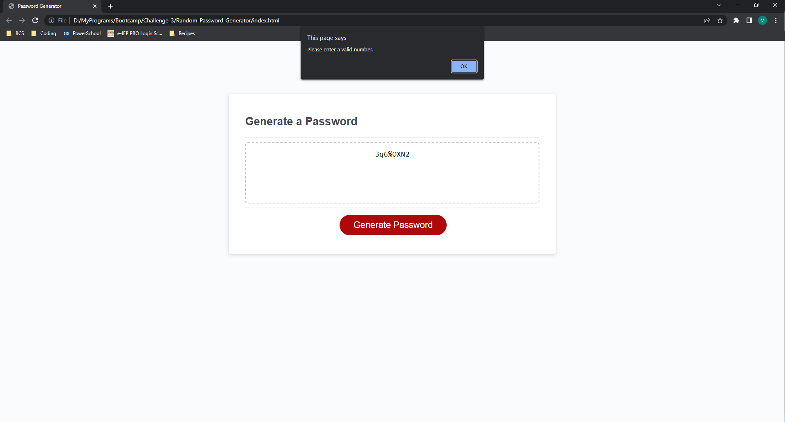

# Random-Password-Generator
## Description

In this challenge I created a program to generate a random password in javascript.  It gathers user input to determine if the user wants numbers, lowercase letters, uppercase letters, or special characters, and asks them how long they want the password to be.  The program ensures that for every selected character type, the generated password contains (at least) one of each type, and returns the value in the field for the user to see.  In this project I learned about calling functions and separating functions based on specific tasks, rather than putting multiple things in a single function.  I learned about outlining a project with pseudo code / brainstorming, and then working to write the logic to get it to function how it was intended.

## Credits

I worked with a partner, Nick Rosales, for this project.  Here's a link to his github.

https://github.com/nickrosales/Random-Password

## Screenshot

## License

We were told we didn't need a license for this activity.

## Link to Deployed Webpage and Repository
https://mpacct.github.io/Random-Password-Generator/
https://github.com/Mpacct/Random-Password-Generator/
